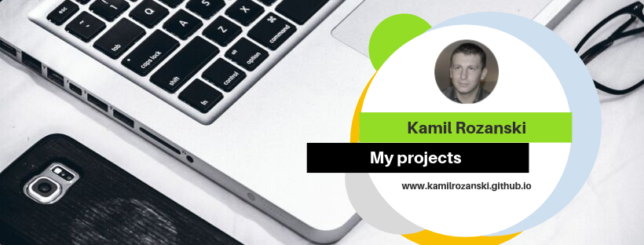

# Kamil Rozanski my personal Webside & CV 🤩

## I built this website after a 12-week Frond-End course.

### Tools & technology, with I've used.

- Semantic HTML 💥
- CSS/grid/flex-box 💥
- SASS 💥
- Fetch API 💥
- Java Script💥
- Figma (https://www.figma.com)💥 
- Gulp/NPM 💥

Programing is my passions, and every day I lear new skills.
New projects will be updated automatically on this page so it is worth to look here 😉
